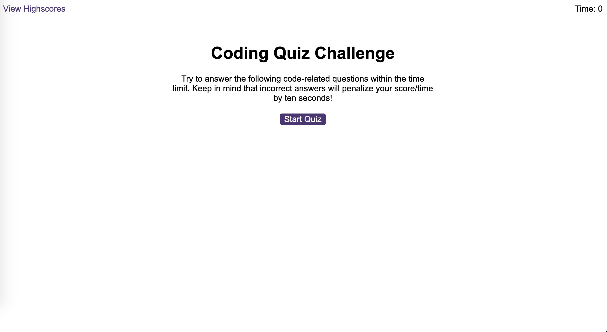

# code-quiz

## Description 
This code-quiz project was created to develop an application tool designed for students to take a timed quiz that records high scores, assessing their progress in JavaScript fundamentals in comparison to others.

The URL of the deployed application: https://itismliu.github.io/code-quiz/

The URL of the GitHub repository: https://github.com/ItIsMLiu/code-quiz

Screenshot of webpage and console:

A starter code pack (as shown in the second commit) was provided, including the HTML files, CSS file, and a JavaScript file. Subsequently, the project was developed incorporating my newly acquired JavaScript knowledge. Below, I've highlighted the integration of these skills within the project:
<!--
- Use of a while loop.
- xxxx
-->
## Installation

N/A

## Usage 
<!--
Open the webpage by clicking on the provided URL link. Click on the red button labeled 'Generate Password.' A window will prompt you to enter a number from 8 to 128, indicating your desired password length. Once you've entered the desired length, the system will ask you to confirm whether to include the four different character types. At least one character type must be included. If you enter a password length that is not in the provided range or don't any character type, the browser will prompt you again until the specified criteria are met. Finally, you will see a randomly generated password based on your selected character type(s) in the dashed box. To generate a new random password, simply refresh the page and repeat the above steps.
-->

## Credits

Other resources used as guides:
- remove the background-color and opacity property using Javascript only: https://stackoverflow.com/questions/40380676/javascript-remove-background-color-and-opacity

## License

MIT license (Please refer to the LICENSE in the repository).